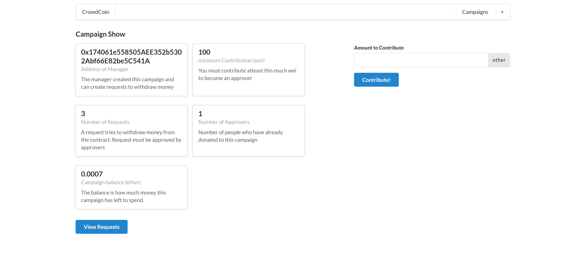
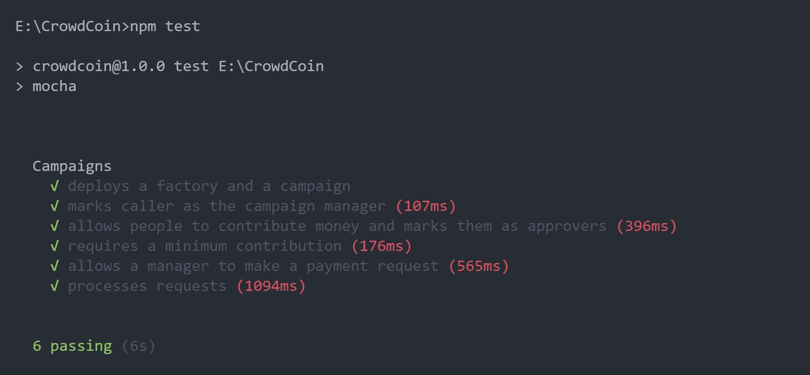

# CrowdCoin

An Ethereum DApp that allows anyone with a startup idea to create a new funding campaign. Contributors get benefit for funding if the project is successful. 

The contributed ether will be stored in the smart contract. The fundraiser can only retrieve funds in each stage of building the product. He should create a request to withdraw money for each stage thereby informing about the plans/progress about the product to the contributors. The request will be fulfilled only when atleast 50% of the contributors approve the request. By this way, we decrease the cases of fraudulent campaigns.

Another interesting feature is that the contributor can retrieve a part of their funds from the campaign if they don't think that the project is going to be unsuccessful. The percentage of money that they can retrieve depends on the amount of funds retrieved by the fundraiser after the person has started contributing to the campaign.

## Campaign contract

<a href="https://rinkeby.etherscan.io/address/">Click here</a> to view the Campaign contract on etherscan

The contract <a href="https://rinkeby.etherscan.io/address/">code</a> has been verified and it is visible on `rinkeby.etherscan.io`

## The DApp User Interface



## Getting Started

These instructions will get you a copy of the project up and running on your local machine for development and testing purposes.

### Prerequisites

Please make sure you've already installed ganache-cli and enabled MetaMask extension in your browser.

### Installing

A step by step series of examples that tell you have to get a development environment running

#### Clone this repository:

```
git clone https://github.com/DineshBS44/CrowdCoin
```

Install all the required npm packages (as listed in `package.json`):

```
npm install
```

#### Launch Ganache:

```
ganache-cli -m "<Seed Phrase>"
```

#### In a separate terminal window, Compile smart contracts:

```
cd ethereum
node compile.js
```

This will create the smart contract artifacts in folder `ethereum\build`.

#### Test smart contracts:

Exit the `ethereum` folder and then run the tests written in `test\Campaign.test.js`

```
cd..
npm test
```

All 6 tests should pass.



#### Migrate/Deploy smart contracts to the Rinkeby Test Network:

```
cd ethereum
node deploy.js
```

Now head to `ethereum\factory.js` file and replace the newly generated contract address

#### In a separate terminal window, launch the DApp:

Exit the `ethereum` folder

```
cd..
npm run start
```

## Built With

- [Ethereum](https://www.ethereum.org/) - Ethereum is a decentralized platform that runs smart contracts
- [Solidity](https://docs.soliditylang.org/en/v0.8.6/) - The most popular language for writing smart contracts
- [ReactJS](https://reactjs.org/) - A JavaScript library for building user interfaces
- [IPFS](https://ipfs.io/) - P2P network for storing and sharing files in a distributed file system
- [Remix - Solidity IDE](https://remix.ethereum.org/) - To compile, test and deploy faster using Javascript VM
- [Visual Studio Code](https://code.visualstudio.com/) - Code Editor
- [Ganache - One Click Blockchain](https://truffleframework.com/ganache) - Local blockchain for testing
- [Metamask](https://metamask.io/) - Wallet Provider
- [Etherscan](https://rinkeby.etherscan.io/) - View and keep track of transactions happening around a smart contract as well as view its code, read and write stuff to it

## Libraries/services used

- **ganache-cli** - For running a local blockchain mostly used for testing purposes
- **dotenv** - For managing data in .env files
- **@truffle/hdwallet-provider** - Used to create a provider using Seed phrase(Mnemonic) and Infura RPC URL to connect to the Rinkeby Test Network
- **web3** - To interact with the deployed smart contract either on Ganache or Rinkeby test network
- **mocha & chai** - To test the smart contracts written in solidity
- **react** - For creating the fronted DApp
- **solc & solhint** - For compiling and linting solidity contracts
- **prettier & prettier-plugin-solidity** - To format the code
- **Etherscan** - View and keep track of transactions happening around a smart contract as well as view its code, read and write stuff to it
- **Remix** - To compile, deploy and test smart contracts on the Javascript VM
- **Metamask** - Ethereum wallet which is connected to the DApp
- **Infura** - For getting the API endpoint to connect to the Etherem network without having to run a full node
- **IPFS** - To make the DApp completely decentralized, the DApp and all its files are hosted to IPFS

## Commands in IPFS to host the project to IPFS

Make sure IPFS-cli is installed

##### Add all the files to IPFS using the command

`ipfs add -r CrowdCoin`

Now the whole project can be view using the link `https://ipfs.io/ipfs/<IPFS_HASH>`

##### To publish the DApp to incorporate changes to be viewed using the same hash, the commands used are

`ipfs daemon`

In an different terminal window, execute the following command to publish

`ipfs name publish <IPFS_HASH>`

Use `https://gateway.ipfs.io/ipfs/<IPFS_HASH>` to see the published project on IPFS

## Developer

<table>
<tr align="center">
<td>
Dinesh B S
<p align="center">

</p>
<p align="center">
<a href = "https://github.com/DineshBS44"></a>
<a href = "https://www.linkedin.com/in/dinesh-b-s-197983192/">

</a>
</p>
</td>
</tr>
  </table>

## License

Licensed under MIT License : https://opensource.org/licenses/MIT

<br>
<br>
